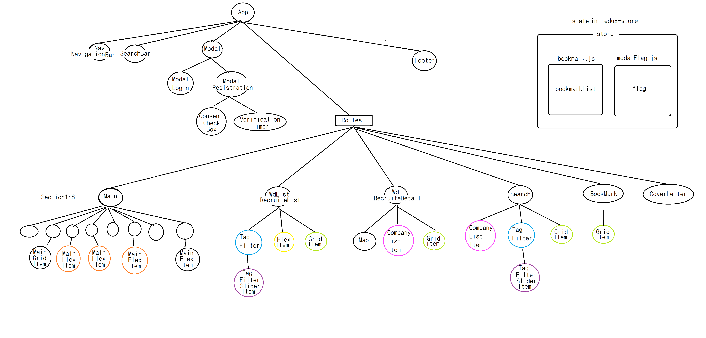

# wanted_clone

workspace for conversion of [wanted_clone](https://github.com/Jin959/wanted_clone) using React

## Result
 - [deploy](https://jin959.github.io/wanted_clone_react/)  
    
    * [src](https://github.com/Jin959/wanted_clone_react/tree/master/src) : components  

    * [css src](https://github.com/Jin959/wanted_clone_react/tree/master/css/)  
    
    * [assets](https://github.com/Jin959/wanted_clone_react/tree/master/css/) is img, svg, so on.. 
      
  

## 원티드 react 변환

- 기존에 html, css, vanillaJS 로 만들던 wanted website의 페이지가 늘어갈 수록 업데이트나 유지보수에 있어 누락이 많이 생겼다.

- 예를 들어 모든 페이지에 존재하는 헤더, 네비게이션 바의 단순한 CSS나 HTML 수정을 하게 되면 다른 모든 페이지를 수정 해주어야 하는데 누락시킨 경험이 있었다.

    * 헤더의 "기업서비스" 버튼의 폰트가 너무 크고 패딩이 없어 이상하게 보여서 수정을 했는데 메인페이지만 수정 되었던 적이 있었다.

- 리액트 라이브러리는 컴포넌트 별로 파일을 나눌 수 있고 컴포넌트를 JSX로 연결 시킬 수 있어 재사용에 좋을 것이다. 즉, 반복적인 코드사용이 줄어들 것이다.

- 리액트를 배우면서 변환시켜 계속 클론 코딩을 진행한다.

1. 기존 html을 통으로 App.js 컴포넌트에 넣고 실행을 확인 한다.
2. 재사용되는 기능과 구획별로 컴포넌트를 분리해간다.

## 컴포넌트 구성

- [big pages in src](https://github.com/Jin959/wanted_clone_react/tree/master/src)

  * BookMark.jsx - 북마크 모음 페이지

  * Main.jsx - 메인페이지

  * RecruiteDetail.jsx - 채용 상세 페이지

  * RecruiteList.jsx - 채용 리스트 페이지

  * Search.jsx - 검색 결과 페이지

- [small components in components](https://github.com/Jin959/wanted_clone_react/tree/master/src/components)

## 상태관리

- using [react-redux](https://github.com/Jin959/wanted_clone_react/tree/master/src/redux_module)

  * index.js

    + bookmark.js

    + modalFlag.js

## 기타 모듈

- [module](https://github.com/Jin959/wanted_clone_react/tree/master/src/module)

## Dummy Data

- [json](https://github.com/Jin959/wanted_clone_react/tree/master/src/json)

  * using in [MainSection2.jsx](https://github.com/Jin959/wanted_clone_react/blob/master/src/components/main/MainSection2.jsx), [TagFilter.jsx](https://github.com/Jin959/wanted_clone_react/blob/master/src/components/tag_filter/TagFilter.jsx), [RecruiteDetail.jsx](https://github.com/Jin959/wanted_clone_react/blob/master/src/RecruiteDetail.jsx), [RecruiteList.jsx](https://github.com/Jin959/wanted_clone_react/blob/master/src/RecruiteList.jsx), [Search.jsx](https://github.com/Jin959/wanted_clone_react/blob/master/src/Search.jsx), [BookMark.jsx](https://github.com/Jin959/wanted_clone_react/blob/master/src/BookMark.jsx)

## SVG components

- [assets](https://github.com/Jin959/wanted_clone_react/tree/master/src/assets)

## Styling

- Styled-components  

  * [ModalLogin.jsx](https://github.com/Jin959/wanted_clone_react/blob/master/src/components/modal/ModalLogin.jsx)

  * [ModalResistration.jsx](https://github.com/Jin959/wanted_clone_react/blob/master/src/components/modal/ModalRegistration.jsx)

  * [App.jsx](https://github.com/Jin959/wanted_clone_react/blob/master/src/App.jsx) in scroll fixing when modal is on

- SASS 

  * [Map.jsx](https://github.com/Jin959/wanted_clone_react/tree/master/src/components/map)
    + [map.module.scss](https://github.com/Jin959/wanted_clone_react/blob/master/src/components/map/css/map.module.scss)